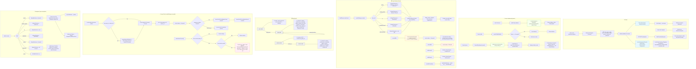

# Application Data Flow

```mermaid
flowchart TD
    %% === PUBLIC REGISTRATION FLOW ===
    subgraph Public ["🌐 Public"]
        A1["Visitor visits /admission/register"] --> A2["Admission\\Register (Livewire)"]
        A2 --> A3["Fills form: name, email, phone, nationality, religion, gender, national_id, password"]
        A3 --> A4["submit() validates & creates"]
        A4 --> A5["Lead (categories=['Parent'], status='New', source='Parent Registration')"]
        A4 --> A6["User (role='parent', lead_id=Lead.id)"]
        A6 --> A7["Auth::login() — auto-login"]
        A7 --> A8["Redirect to /parent dashboard"]
        
        A9["Guest visits /register"] --> A10["Redirects to /admission/register"]
        
        A11["API POST /api/register"] --> A12["AuthController@register"]
        A12 --> A13["User (role='parent') + token with ['parent'] ability"]
        
        %% Lead model auto-extracts birth_date
        A5 -.- A5b["Lead::booted saving: if Egyptian & national_id, extractBirthDateFromNationalId() → sets birth_date"]
    end
    
    %% === PARENT DASHBOARD ===
    subgraph ParentDash ["👤 Parent Dashboard (/parent)"]
        B1["Parent logs in"] --> B2["Parent\\Dashboard::mount()"]
        B2 --> B3["Load parent Lead by auth()->user()->lead_id"]
        B3 --> B4["loadChildren(): Lead::where('parent_id', parentLead.id)"]
        B4 --> B5["Display children cards"]
        
        B6["Add Child form"] --> B7["addChild() validates"]
        B7 --> B8["Lead (categories=['Student'], parent_id=parentLead.id, status='New')"]
        B8 --> B9["Reload children, flash 'Child added!'"]
        
        B10["Cancel child"] --> B11["cancelChild($childId)"]
        B11 --> B12{"Status === 'Accepted'?"}
        B12 -->|"Yes"| B13["Flash error, return"]
        B12 -->|"No"| B14["Lead::delete()"]
        B14 --> B15["Reload children"]
        
        B5 -.- B5b["If child status='Accepted': lookup Contact by email/national_id → get linked Student"]
    end
    
    %% === ADMIN → LEADS PIPELINE ===
    subgraph AdminLeads ["📋 Leads Pipeline (/leads)"]
        C1["Staff/Parent visits /leads"] --> C2["Leads\\Manage::render()"]
        C2 --> C3{"User role?"}
        C3 -->|"parent"| C4["allowedCategories = ['Student'], scope by parent_id"]
        C3 -->|"student_affairs"| C5["allowedCategories = ['Student','Parent']"]
        C3 -->|"hr"| C6["allowedCategories = ['Employee']"]
        C3 -->|"academic/control"| C7["allowedCategories = ['Student']"]
        C3 -->|"admin (default)"| C8["allowedCategories = null (all)"]
        
        C4 --> C9["getFilteredQuery() builds query with filters"]
        C5 --> C9
        C6 --> C9
        C7 --> C9
        C8 --> C9
        
        C9 --> C10["Apply: search, category, stage, age sort, paginate(10)"]
        C10 --> C11["Render view with leads, counts, filters"]
        
        C12["accept($id)"] --> C13["Lead::transferToContact() → creates Contact (+ Student if Student category)"]
        C13 --> C14["Lead->status = 'Accepted'"]
        C14 --> C15["ensureUserForLead() → creates User if no existing account by lead_id or email"]
        
        C16["refuse($id)"] --> C17["Lead->status = 'Refused'"]
        
        C18["bulkAccept()"] --> C19["Iterates selectedLeads → accept() each"]
        C20["bulkRefuse()"] --> C21["Iterates selectedLeads → refuse() each"]
        
        C22["selectAll checkbox"] --> C23["getFilteredQuery() → pluck IDs → selectedLeads"]
    end
    
    %% === DATA RELATIONSHIPS ===
    subgraph DataModel ["🗄️ Data Model"]
        D1["leads table"]
        D1 --- D1a["id, nameEn, nameAr, email, phone, nationality, religion, gender, birth_date, national_id, categories (JSON), status, grade_id, parent_id (self-ref), mother_id, source"]
        
        D2["users table"]
        D2 --- D2a["id, name, email, password, role, lead_id (FK → leads.id)"]
        
        D3["contacts table"]
        D3 --- D3a["id, nameEn, nameAr, email, phone, nationality, religion, gender, national_id, categories (JSON), parent_id (FK → contacts.id)"]
        
        D4["students table"]
        D4 --- D4a["id, contact_id (FK → contacts.id), grade_id"]
        
        D2 -->|"lead_id FK"| D1
        D1 -->|"parent_id self-ref"| D1
        D4 -->|"contact_id"| D3
    end
    
    %% === ACCEPT FLOW DETAIL ===
    subgraph AcceptFlow ["✅ Accept Flow (Leads\\Manage::accept())"]
        E1["Lead loaded with parent, mother"] --> E2{"Has parent_id, mother_id?"}
        E2 -->|"Yes"| E3["acceptParentOrMother() — find existing Contact or transferToContact()"]
        E2 -->|"No"| E4["Lead::transferToContact() → Contact"]
        E3 --> E4
        E4 --> E5["Link Contact.parent_id / mother_id"]
        E5 --> E6["Lead->status = 'Accepted'"]
        E6 --> E7{"categories include 'Student'?"}
        E7 -->|"Yes"| E8["ensureUserForLead(parentLead, 'parent')"]
        E8 --> E9["ensureUserForLead(studentLead, 'student')"]
        E7 -->|"Only 'Parent'"| E10["ensureUserForLead(lead, 'parent')"]
        
        E11["ensureUserForLead()"] --> E12{"User exists by lead_id?"}
        E12 -->|"Yes"| E13["Return existing"]
        E12 -->|"No"| E14{"User exists by email?"}
        E14 -->|"Yes"| E15["Return existing"]
        E14 -->|"No"| E16["Create User: email = lead->email ?? '{role}_{leadId}@school.local', password = random 16-char, role = $role, lead_id = lead->id"]
    end
    
    %% === NAVIGATION ===
    subgraph Nav ["🧭 Navigation (layout.navigation)"]
        F1["auth()->user()"] --> F2{"Role?"}
        F2 -->|"parent"| F3["allowedSections = ['parent']"]
        F2 -->|"student_affairs"| F4["allowedSections = ['students']"]
        F2 -->|"hr"| F5["allowedSections = ['hr']"]
        F2 -->|"academic"| F6["allowedSections = ['academic']"]
        F2 -->|"control"| F7["allowedSections = ['control']"]
        F2 -->|"admin/null"| F8["allowedSections = all sections"]
        F2 -->|"guest"| F9["allowedSections = []"]
        
        F3 --> F10["Parent sees: 'My Dashboard' section tab + 'Admission Status' link"]
        F10 --> F11["My Dashboard → /parent"]
        F10 --> F12["Admission Status → /leads?categories=Student,Parent"]
        
        F8 --> F13["Admin sees: Students Affairs, HR, Academic, Control, Admin section tabs with full subnav"]
    end
    
    %% === STYLING ===
    style A5 fill:#e6f7ff,stroke:#1890ff
    style A6 fill:#e6f7ff,stroke:#1890ff
    style B3 fill:#f6ffed,stroke:#52c41a
    style B8 fill:#f6ffed,stroke:#52c41a
    style C13 fill:#fff7e6,stroke:#fa8c16
    style C17 fill:#fff1f0,stroke:#ff4d4f
    style D1 fill:#f0f0f0,stroke:#595959
    style D2 fill:#f0f0f0,stroke:#595959
    style D3 fill:#f0f0f0,stroke:#595959
    style D4 fill:#f0f0f0,stroke:#595959
    style E16 fill:#fff0f6,stroke:#eb2f96
```
